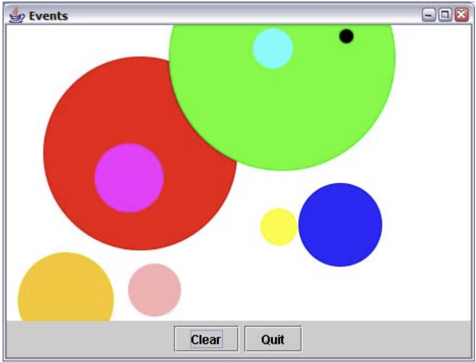

# Laboratoire 09
Durée du laboratoire: 4 périodes

## 1. Introduction
Il s’agira de se familiariser avec la gestion de l’interface graphique Java (API Swing, événements et classes
internes) en réalisant une application permettant de dessiner des disques.


**Un disque est défini par:** <br/>
- Son centre, lors de la pression du bouton (gauche) de la souris.
- Son rayon, par la distance entre son centre et le point où est relâché le bouton de la souris.
- Son identifiant, permettant de déterminer la couleur à utiliser pour le dessiner dans une liste de couleurs prédéfinies.

**De plus:**
- Avant que le bouton de la souris ne soit relâché, il doit être possible de visualiser le disque en cours de
  création.
- Un disque doit pouvoir être effacé en utilisant le bouton droit de la souris (ou de la séquence équivalente sur Macintosh). Si deux ou plusieurs disques sont superposés, effacer celui qui a été ajouté le plus récemment.
- Un disque doit pouvoir être déplacé en appuyant sur la touche **SHIFT** et par opération glisser-déplacer. Le disque doit être visible au cours de son déplacement.
- Le bouton **Clear** permet de réinitialiser l'application et le bouton Quit de la quitter.

## Mise en oeuvre
**Listes:** <br/>
- Utiliser la classe _LinkedList_.
- Pour pouvoir parcourir une liste dans les deux sens, utiliser l’interface _ListIterator_ (et non pas simplement Iterator).

**Modules à importer:** <br/>
- _javax.swing.*_, _java.awt.*_ et _java.awt.event.*_.

**Composants graphiques:** <br/>
|Elément|Classe|
|:------|:----:|
|Fenêtre principale|JFrame|
|Zône de dessin (centre)|sous-classe de JPanel|
|Zône de boutons (bas)|JPanel|
|Boutons|JButton|

**Ajout d'un composant fils dans un composant (p.ex. d'un JButton dans un JPanel):** <br/>
- Eventuellement définition d'un layout (p.ex. _frame.getContentPane().setLayout(LayoutManager)_).
- Ajout dans une JFrame: _frame.getContentPane().add(...)_.
- Ajout dans un JPanel: _panel.add(…)_.
- Voir la documentation des classes JFrame, JPanel, LayoutManager et ses sous-classes (notamment BorderLayout).

**Dimensionner une fenêtre à la taille préférée de ses composants:** <br/>
- _frame.pack()_.
- Si un des composants est une spécialisation d'un composant existant (p.ex. une extension de JPanel), la méthode _public Dimension getPreferredSize()_ devra y être redéfinie.

**Rendre visible une JFrame:** <br/>
- frame.setVisible(true).

**Dessin dans un JPanel:** <br/>
- Définir la couleur de fond d'un composant: _setBackground(Color c)_.
- Méthode de dessin automatiquement appelée par le système sur tous les composants, à éventuellement redéfinir: _public void paintComponent(Graphics g)_.
- Primitives de dessin: voir la classe Graphics.

**Evènements:** <br/>
- Boutons, au moyen d'une classe anonyme:
    ```
    button.addActionListener(new ActionListener() {
     public void actionPerformed(ActionEvent e) {
     /* gestion de l'évènement */
    }}) ;
    ```
- Fenêtre de dessin:
    - Implémenter les interfaces MouseListener et MouseMotionListener dans la classe gérant le dessin.
    - Enregistrer les objets de cette classe comme pouvant répondre aux évènements de la souris (_addMouseListener(this)_ et _addMouseMotionListener(this)_ dans le constructeur).
- Détection d’une pression du bouton droit dans public void _mousePresseed(MouseEvent e)_:
  _e.getButton() == MouseEvent.BUTTON3_ (ou _e.isPopupTrigger()_).
- Détection de l’appui de la touche SHIFT (permettant le déplacement d’un disque): à rechercher dans la documentation Java !